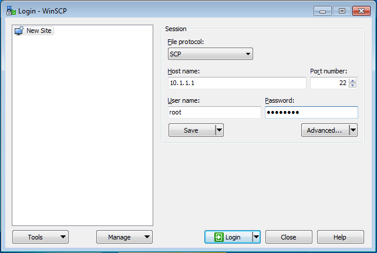
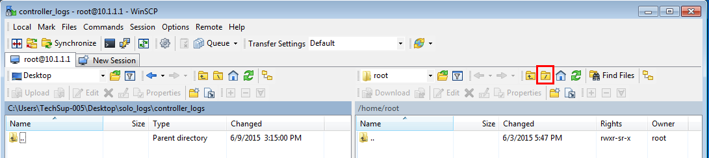
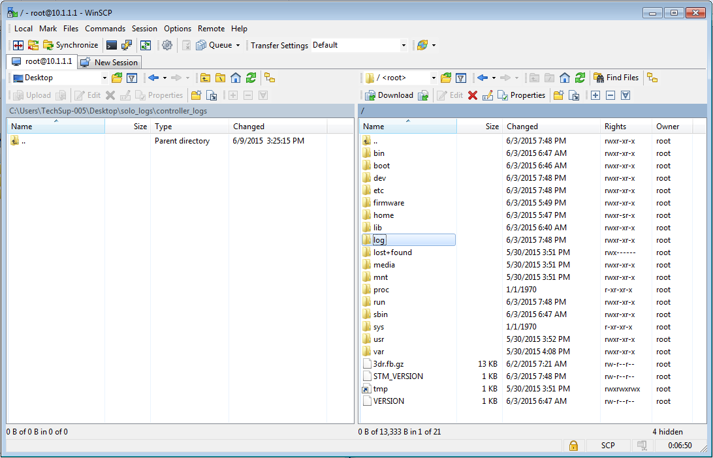
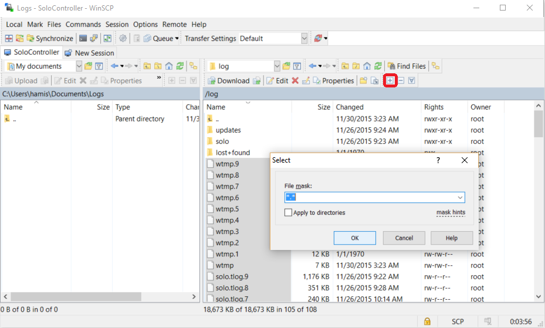

# System Logs

Solo and the Controller log system behaviour and telemetry during all stages of operation. The logs are created in the `/log` directory on both Solo and the Controller.

<aside class="tip">System logs are used by 3DR Technical Support for debugging issues with Solo. Some of the logs (for example telemetry logs) can be analysed directly by developers.</aside>

This topic explains how to download the logs for both [normal end users](#downloading-logs-users) and [developers](#downloading-logs-developers). At the end there is a brief overview of the more important [log types](#log-types).


## Downloading Logs (developers)

Solo *developers* will find it easiest to use the *Solo CLI tool* ``solo logs download`` command to fetch both solo and controller logs to the current directory. For more information see: ["solo" Command Line Tool](starting-utils.html#downloading-logs).

<aside class="tip">We don't recommend this tool for non-developers because it requires additional dependencies
including Python and PyPi to be installed.</aside>

## Downloading Logs (users)

Solo *users* on Mac OSX and Ubuntu (and many other Linux distributions) should get the logs using the [SCP](#downloading-using-scp-mac-linux) program. This program is installed by default on these operating systems, and can be accessed through the terminal application.

Windows users can instead use [WinSCP](#downloading-using-winscp-windows). This allows you to copy files between Solo and the host computer using a graphical interface. 

A step-by-step guide for both approaches is provided below.


### Downloading using SCP (Mac/Linux)

The SCP (Secure Copy Protocol) program is a great end-user tool for downloading the logs because it is available by default from the terminal on Mac OX and many Linux distributions (including Ubuntu 14.04.3 LTS). 

The main steps for getting the logs are:

1. Turn on the Solo Controller and Solo and connect your computer to the Solo WiFi network.
   
   <aside class="tip">The default name of the Solo Controller network is  "SoloLink" 
   and the default network password is "sololink". You may have changed these during your initial setup.
   </aside>

1. Open a Terminal (on Mac OSX this can be found in *Finder* under menu: **Go | Applications | Utilities | Terminal**).
1. Enter the following commands into the terminal to create directories for the logs and copy the files:

   <div class="host-code"></div>

   ```
   mkdir solo controller
   scp root@10.1.1.10:/log/* ./solo
   scp root@10.1.1.1:/log/* ./controller
   ```
   
   * Answer "yes" if prompted to confirm the authenticity of the host. 
   * Enter the following password (case-sensitive) when prompted: ``TjSDBkAu``
   
1. Wait for the transfer to complete.


### Downloading using WinSCP (Windows)

*WinSCP* is a GUI version of SCP for Windows. It allows you to view the Solo Controller or Solo file system graphically, and copy the log files using a drag-drop approach. 

The main steps for getting the logs are:

1. [Download and install WinSCP from here](http://winscp.net/download/winscp573setup.exe).

1. Turn on the Solo Controller and Solo and connect your computer to the Solo WiFi network.
   
   <aside class="tip">The default name of the Solo Controller network is  "SoloLink" 
   and the default network password is "sololink". You may have changed these during your initial setup.
   </aside>

1. Open *WinSCP* and select **New Site**: 
   

1. Enter the following site information and then press **Login**:

   * **File protocol**: SCP
   * **Solo Controller Host IP address:** 10.1.1.1
   * **Port number:** 22
   * **User name:** root
   * **Password:** TjSDBkAu

   In "Commander" mode the app will open a view showing your computer file-system on the left and the 
   Solo Controller view on the right.

   <aside class="note">The process to download Solo logs is the same as for the Controller, except for Solo's target IP address:

   * **Solo Host IP address:** 10.1.1.10
</aside>
   

1. Navigate to the *root directory* (one easy way to do this is to select the "/" button):
   

1. Double click on the “log” folder. 
   

1. Select all the files in the directory (do not select folders). 

   You can do this using normal Windows methods, or click on the **+** icon and choose **OK** to confirm the file mask.
   

1. Copy the files from Solo Controller to the host computer. 

   You can specify the target folder in the left-pane and click on the **Download** button to start the copy (or just drag
   and drop the selected file).

   Wait for the transfer to complete!

1. Repeat the process to copy files from Solo (the only difference is that the target IP address is ``10.1.1.10``). 


## Log Types

The system logs directory (`/log` on both Solo and the Controller) contains all the logs, including telemetry logs, shot logs, and logs for different subsystems.

<aside class="note">The `/log` directory is actually a separate, dedicated partition.</aside>

Logs of a particular type share the same prefix (e.g. `solo.tlog`) and have a numeric suffix to indicate how old they are (e.g. `solo.tlog` is the most recent log, `solo.tlog.1` is the second most recent log, etc.). When a new log is created all logs are pushed down one number. At most, 20 logs are saved!

The main log types are listed below (we hope provide information about the other logs [as it becomes available](https://github.com/3drobotics/solodevguide/issues/224)).


### Solo Controller

* **solo.tlog** - Telemetry logs received by the controller. These can be analysed by developers (they are standard MAVLink tlogs).
* **3dr-solo.log** - Catch-all log, including *dataflash_logger* information.
* **3dr-top.log** - CPU usage statistics.
* **3dr-temp.log** - Temperature logs.

### Solo

* **shotlog.log** - Shot manager logs. These contain various high level events triggered by the shots, such as received input and the status of the gimbal and camera. This will (usually) also include the Python stack trace if *ShotManager* crashes.
* **3dr-solo.log** - Catch-all log, including *dataflash_logger* information.
* **3dr-telem.log** - Logs for bidirectional telemetry bandwidth. This contains information from *telem_forwarder*, the process that communicates on the serial port to PixHawk and relays the telemetry to clients (Controller as a special case and other "clients" that connect - e.g. dataflash_logger).
* **3dr-top.log** - CPU usage statistics.
* **3dr-temp.log** - Temperature logs.
* **shotlog.nnn.log** - Symlinks to shotlogs provided for backwards compatibility (can be ignored).


