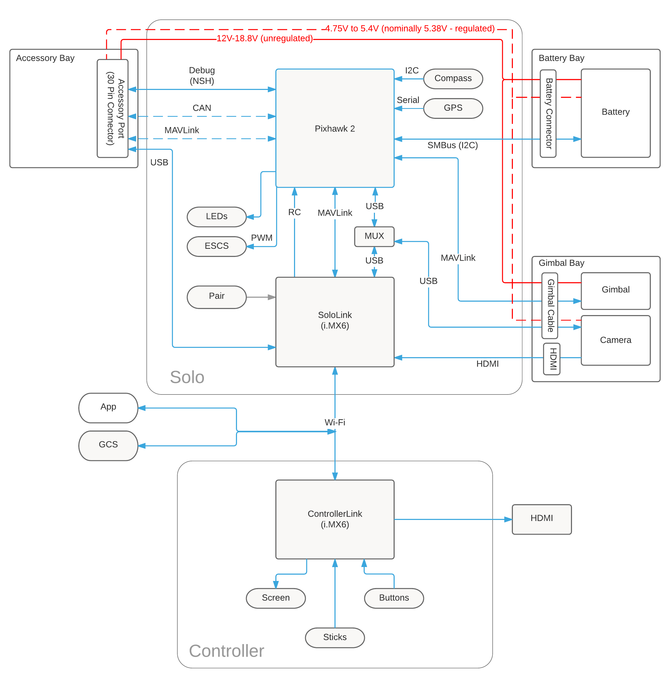

# Architectural Overview

Solo is a Linux system (iMX.6 running [Yocto Linux](advanced-linux.html)) connected to a Pixhawk autopilot.

The Pixhawk controls flight modes, stabilization, and recovery in the case of an RTL event (return-to-launch). Pixhawk communicates over the MAVLink telemetry protocol to both the on-board Linux computer and downstream devices like the Controller and mobile phone Solo apps.

The Linux system controls high-level operation of the copter: [smart shots](concept-smartshot.html), camera and gimbal control, mobile app communication, and accessory interaction are all implemented in this layer.

## Solo System Diagram

## Solo hardware/software stack

* [3DR Poky](advanced-linux.html) (based on Yocto Project Reference Distro, Poky 1.5.1)
* Python 2.7.3
* ARM Cortex A9 ([i.MX6 Solo](http://www.freescale.com/products/arm-processors/i.mx-applications-processors-based-on-arm-cores/i.mx-6-processors/i.mx6qp/i.mx-6solo-processors-single-core-multimedia-3d-graphics-arm-cortex-a9-core:i.MX6S) by Freescale), 1Ghz, 1 CPU core with VPU and GPU
