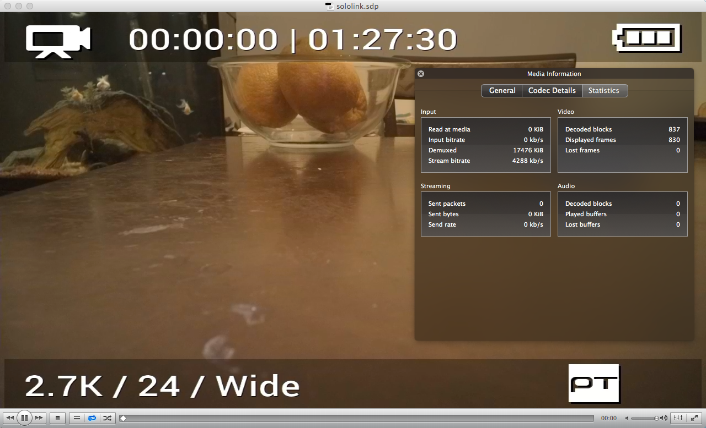

# Video Pipeline

In normal operation, the GoPro video device (`/dev/video0`) is acquired exclusively by Solo's video encoder (*sndast*). This topic explains how you can split the video device and use it as needed. It also shows how to view the live video from Solo on your computer.

Video pipeline:

* GoPro ->
* HDMI cable ->
* HDMI encoder ->
* iMX6 (h.264 encode/gstreamer) ->
* WiFi (UDP) ->
* Controller (h.264 decode/hdmi output/UDP relay to phone) ->
* WiFi (UDP) ->
* App


## Viewing Live Video

You can use VLC on your computer to view live video as it is being recorded by Solo.

First, we need to tell Solo that we want to enable video output. The easiest way to do so is to connect to Solo via Solo mobile app, which will tell Solo to start streaming video. Leave this open.

Next, create a file `sololink.sdp` with the contents:

<div class="any-code"></div>

```
c=IN IP4 10.1.1.1
m=video 5600 RTP/AVP 96 
a=rtpmap:96 H264/90000
t=0 0
```

This file describes the RTP stream configuration for Solo's video stream. Now, you can open this file using a video player such as [VLC](http://www.videolan.org/vlc/index.html).




## Using Solo's Video Programmatically

We are working on a new video pipeline with public APIs to address this use case. Information will be published as soon as it becomes available.
