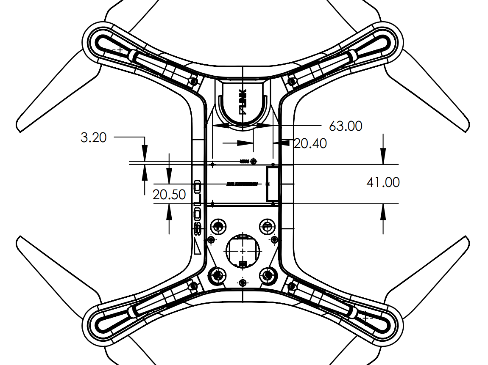
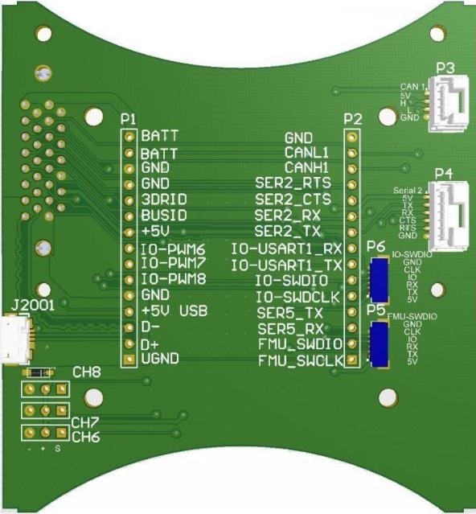
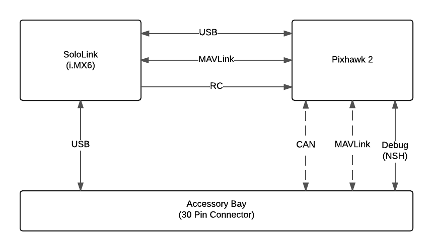

# Accessory Bay

The *Accessory Bay* is the area behind the gimbal under the Solo that does not interfere with the 3DR Gimbal. It is intended for secondary accessories, including additional communications hardware and high power devices.

Accessory developers can attach hardware using the holes provided and connect to the iMX6 (Companion computer) via USB.

## Mechanical

The accessory area is roughly 7.6 cm wide x 13.3 cm long x 10.2 cm deep. 

Maximum payload of the system is 700g, the 3DR Gimbal + GoPro weigh approximately 390g, leaving 310g for accessories that are meant to be used with the 3DR Gimbal.

The Accessory Bay hole pattern is M2 screws in a 63 mm x 41 mm rectangular pattern. Ensure that the rectangle is not intersected by the path of the gimbal.

<aside class="note">
Accessories are permitted to cover the <a href="https://3dr.com/kb/pairing-solo-controller/">Pairing button</a>.
</aside>

The diagram below shows the position of the accessory port.

## Electrical

### Accessory Port

The mating connector part number is [JAE SJ038252](https://jae-connectors.com/en/pdf_download_exec.cfm?param=SJ038252.pdf) and can be purchased on [Mouser](http://www.mouser.com/ProductDetail/JAE-Electronics/TX24-30R-6ST-N1E/?qs=%2fha2pyFaduiqgba8kBa6TtehVWNIeLFx3lhQ48lSxiSCqywLxSV2eg%3d%3d).

The pinout of the *Accessory Port* is:

Pin | Name | Description
--- | --- | --- 
1. | USB D- | Negative differential data signal to iMX6 OTG USB port.
2. | USB D+ | Positive differential data signal to iMX6 OTG USB port.
3. | N/C | 
4. | N/C | 
5. | N/C |  
6. | N/C | 
7. | N/C |  
8. | N/C |  
9. | SER5 TX (DEBUG) | UART5 TX output from Pixhawk&trade; 2.
10. | SER2RT | UART2 RTS output from Pixhawk&trade; 2 for flow control. Connect to device's CTS pin.
11. | SER2Tx | UART3 RX signal to Pixhawk&trade; 2. Connect to device's TX pin. Voltage is 3.3V.
12. | CANH1 | CAN bus high to the Pixhawk&trade; 2.
13. | CANL1 | CAN bus low to the Pixhawk&trade; 2.
14. | GND | Ground reference on Solo system.
15. | BATT | 12V to 16.8V. Maximum combined current off bus (pins 15 and 30) is 1.1A (fuse: 1812L110/24DR). Maximum combined power 18.5W.
16. | USB GND |  
17. | +5V | 4.75V to 5.4V voltage pin for USB device. Maximum combined current off bus (pins 17 and 19) is 1.05A (fuse: ST890DTR). Maximum combined power 5.7W.
18. | N/C |  
19. | +5V | 4.75V to 5.4V voltage pin for USB device. Maximum combined current off bus (pins 17 and 19) is 1.05A (fuse: ST890DTR). Maximum combined power 5.7W.
20. | N/C |  
21. | GND | Ground reference on Solo system.
22. | N/C |  
23. | BUS ID |  
24. | SER5 RX (DEBUG) | UART5 RX input to Pixhawk&trade; 2.
25. | SER2CT | UART2 CTS input to Pixhawk&trade; 2 for flow control. Connect to device's RTS pin.
26. | SER2Rx | UART3 TX signal from Pixhawk&trade; 2. Connect to device RX pin. Voltage is 3.3V.
27. | 3DRID | USB ID pin for OTG port on iMX6 OTG port
28. | GND | Ground reference on Solo system.
29. | GND | Ground reference on Solo system.
30. | BATT | 12V to 16.8V. Maximum combined current off bus (pins 15 and 30) is 1.1A (fuse: 1812L110/24DR). Maximum combined power 18.5W.

<aside class="note">
The CAN (<a href="http://uavcan.org/UAVCAN)">UAVCAN</a>) and SERIAL BUS connections to Pixhawk&trade; are "not supported" by 3DR for external developer use.
</aside>

### Power Supply

Two voltage sources are supplied to the *Accessory Bay*:

* VCC 5V (4.75V to 5.4V).
* VCC Battery (12V to 16.8 V).

*VCC 5V* should be used to power the USB device. The combined total current for both *VCC 5V* pins is limited to 1.05A (the combined current for both pins).
<aside class="caution">
The VCC 5V supply is also used as the backup supply for the Pixhawk&trade;. Attempting to draw more than the specified maximum current may drop the voltage, and could potentially cause a brownout.
</aside>

*VCC Battery* can be used as a high-power supply for accessory hardware. The combined total current for both *VCC Battery* pins is limited to 1.1A (fuse: 1812L110/24DR) and the maximum power 18.5W.

### Accessory Breakout Board

An open source reference design for a breakout board can be found [here](https://github.com/3drobotics/Pixhawk_OS_Hardware/tree/master/Accessory_Breakout_X1).

The breakout board plugs into the accessory port. The exposed side of the board is as shown below.

## Communication Architecture

The main communication channels between the Accessory Bay, Pixhawk&trade; and Companion Computer are shown below. Note that only USB is available for developer communication with Solo (the CAN and Serial/MAVLink channel is shown dashed for this reason). 

## Communication Protocol

The USB OTG port is the recommended interface to the *Accessory Bay*. The port can act as either host or as a device, but typically the iMX6 acts as the host and the accessory as a connected USB device. The USB port enables interactions with Smart shots, DroneKit, and the Controller.

### Supported Drivers

The iMX6 kernel comes with with drivers for FTDI and CDC-ACM USB serial devices. These can, for example, be used with all official Arduino devices.

### Connecting directly to the USB Port

Accessories typically connect to Solo as devices. Connect `3DRID` to `GND` to set the USB port to host mode. Connect 5V, `USB D+`, `USB D-` and `GND` to the corresponding pins of the USB device.

The IMX6 will connect in device mode if the 3DRBUS pin is not connected to GND. In device mode you can connect the Solo to a computer.

### Connecting via an Accessory Breakout Port

If you have the recommended [accessory breakout board](#accessory-breakout-board), use a jumper to connect `3DRID` to ground to set the iMX6 to host mode. Then use a [USB OTG cable](http://www.amazon.com/Micro-USB-OTG-Adapter-Cable/dp/B00D8YZ2SA)) to connect the device to the breakout board.

### Accessing USB Serial devices

USB Serial devices are accessed using normal Linux methods. For example, to communicate with a USB serial adapter or Arduino from Python, you could use http://pythonhosted.org/pyserial/.

<aside class="tip">
Use the <strong>/dev/serial/by-id/</strong> paths to access USB serial devices on the IMX6, as the enumeration order may change.
</aside>

### USB Connection Speed

The USB routing on the mainboard does not meet the spec for USB “High Speed” (480Mbit/s), so the maximum in-spec speed is “Full Speed" (12Mbit/s). In practice most high speed devices should work. 

The actual throughput will depend on the device being used.

