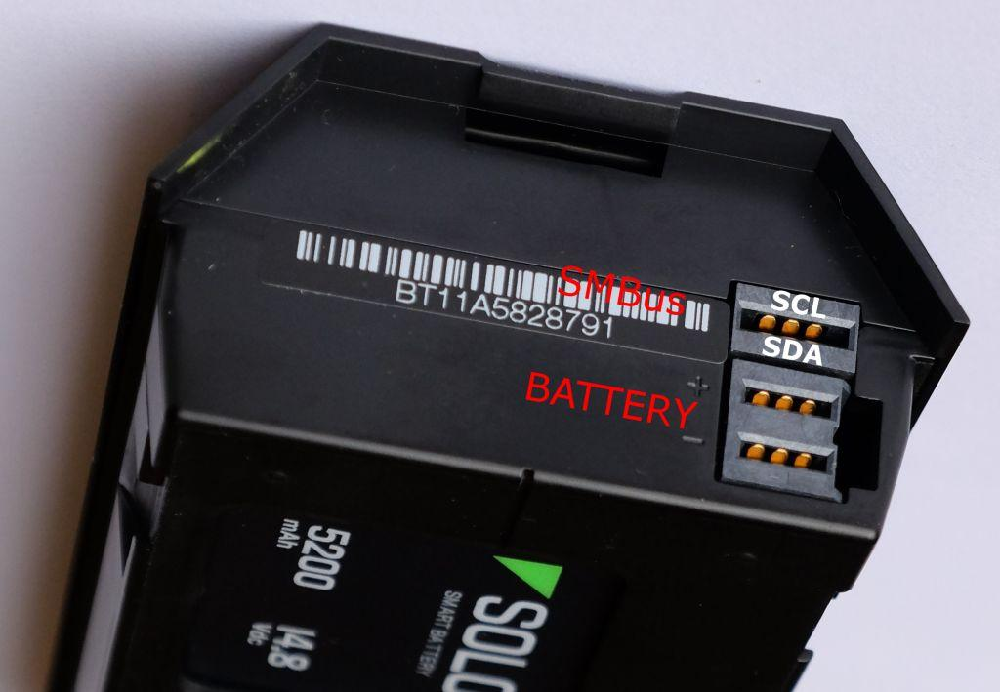

# Battery Charger Interface

This topic specifies the charging interface to the Solo battery (this is needed if you want to build chargers, charging pads, etc).

<aside class="tip">See the <a href="hardware-batterybay.html">Battery Bay</a> page for information needed to develop alternative power supply products for Solo.</aside>

## Solo Battery Specifications

The Solo battery has the following physical and electrical specifications:

* 500 grams
* Total capacity: 5.2 Ah (not a required spec)
* Charge rate: 1-2C
* Charging temp: 0C ~ 40C
* Discharge rate (continuous): 20A
* Discharge rate (burst): 120A
* Operating voltage range: 10.0 V to 16.8 V
* Discharging operating temp: -20C ~ 60C

## Mechanical Interface

The charger must be able to physically connect to the battery (the available space for the connector is bounded by the top cover of the battery (see [figure below](#fig4.5.1)).

## Electrical Interface

The electrical interface with Solo uses the following connectors:

* Battery side connector (female) is a Molex 171090-0048 ([PDF](https://drive.google.com/open?id=0B9l93ZUM5ooxMU0xM3h5MzNsMjVBV3NjYU9DSEdyZE5FQWhR)). This is a custom connector that can only be purchased in minimum orders of 1,000 units.

* Solo / charger side connector (male) is a Molex 171088-0048 ([PDF](https://drive.google.com/open?id=0B9l93ZUM5ooxblFVOVhuY2JwMExjd3FnYjgzZmNsNy1ialAw))

The battery interface has 3 prongs with 4 contacts. The SMBus connector has 2 contacts: SCL (top) and SDA (bottom) on the top-most prong.  The Battery `+` and `-` are the bottom 2 prongs. The battery and SMBus must share a common ground.

The connector contacts are rated for 40A on the power contacts.

## Communication Protocol

Solo uses the [standard SMBUS spec](https://drive.google.com/open?id=0B9l93ZUM5ooxXzZWT3FMdktaNjNGWDV6M0tQUDhwWWgtNEFB) for communicating with the battery. To interface with the battery it is best to implement the full specification.
