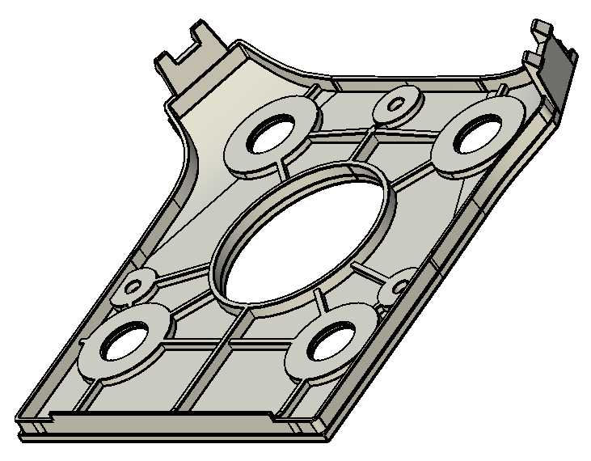

# Gimbal Bay

The Gimbal Bay provides an extensible interface intended for attaching [Made For Solo](https://3dr.com/mfs/)-approved 3-axis gimbal and camera solutions.

<aside class="tip">
The Gimbal Bay can also be used for other types of Solo add-ons.
</aside>

## Mechanical

The Gimbal Bay area comprises the lower-front area of Solo, extending back as far as the accessory bay and into the vehicle body.

The mechanical interface points with Solo are:

* Gimbal connector plate
* Two front clips
* Four screws
* HDMI and Solo Gimbal Cable
* Keep-out zones for accessory bay

We recommend that you use the *Solo Gimbal Beauty Plate* as the basis for your own connector plate, as it correctly implements the required mechanical interface points. The CAD file for the plate can be [downloaded from here](https://docs.google.com/a/3drobotics.com/uc?id=0B9l93ZUM5ooxT3lSeHhwZ3VvSmc&export=download) and a screenshot is shown below.

The maximum payload of Solo with gimbal, camera and other accessories is 700g.  Camera/Gimbal solutions that exceed the weight of the 3DR Gimbal and GoPro (390g) may not work with all accessories.

<aside class="todo">
This section is incomplete. The following information is still missing:
* Screws: type, positions, diameter, length, anything else
* Keepout/reserved areas: Diagrams
* Images/definition of the available space within the body of the vehicle.
</aside>

## Electrical

There are two physical connections from the Solo to a gimbal. The [Solo Gimbal Cable](#solo-gimbal-cable), which primarily manages the position and recording state of the camera, and the [HDMI Micro cable](#hdmi-micro-cable) which routes the video signal. 

### Solo Gimbal Cable

The *Solo Gimbal cable* terminates in a [Molex 5031490800](http://www.digikey.com/product-detail/en/5031490800/5031490800-ND/3071369) connector. A gimbal board is connected using the corresponding [Molex 5031540890](http://www.digikey.com/product-detail/en/5031540890/5031540890-ND/2819082) connector. 

Pin | Name | Color | Description
--- | --- | --- | ---
1 | VCC Battery | Red | 12V to 16.8V. Max recommended current/power is ~3A/50W. Drawing additional current may damage the battery and increases the risk of accident.
2 | VCC 5V | Yellow | 4.75V to 5.4V voltage pin for Camera (only). Current should be less than 1A.
3 | GND (Gimbal) | Black |
4 | GND (USB) | Brown |
5 | Gimbal Rx | White |
6 | Gimbal Tx | Green |
7 | USB D+ | Blue | Positive differential data signal to iMX6 OTG USB port.
8 | USB D- | Violet | Negative differential data signal to iMX6 OTG USB port.

#### Power Supply

The Gimbal Cable supplies two different voltage sources to the Gimbal Bay:

* VCC 5V (4.75V to 5.4V).  
* VCC Battery (12V to 16.8 V). 

*VCC 5V* should be used to power the camera (only). The camera must not draw more than 1A. 

<aside class="note">
The *VCC 5V* supply is also used as the backup supply for the Pixhawk. While the current is not limited, if more than 1A is used the vehicle may fail when running on backup power.
</aside>

*VCC Battery* can be used to power the gimbal or other hardware. The maximum recommended current/power is ~3A/50W. Drawing more current may damage the battery and increases the risk of accident.

#### Control over MAVLink with Serial

The Gimbal TX and Gimbal RX lines send [MAVLink](http://qgroundcontrol.org/mavlink/start) data over a serial connection between the Pixhawk flight controller and the gimbal. This connection is used to both control the pitch, roll, and yaw of the gimbal motors as well as send commands over to the camera (start recording, stop recording, change modes, etc). More details on camera control can be found in the [Software Interface](#software-interface) section.

#### Co-processing with USB

The Gimbal Cable provides a USB 2.0 interface with the iMX6 co-processor on-board Solo. This interface should be used for firmware updating and can optionally be used for any sort of additional processing. For example, you can pull a still from the camera, transfer it to the co-processor, and search the image for pre-defined target.

<aside class="note">
USB2.0 data rates might not be achievable via the Gimbal Bay USB interface.
</aside>

<aside class="note">
Communication between the Solo co-processor and the gimbal is not yet available for 3rd party developers.
</aside>

### HDMI Micro Cable

The [HDMI](https://en.wikipedia.org/wiki/HDMI) Micro (Type D) connection is responsible for transferring video from the camera on the Solo to the first person view in the 3DR app. The HDMI connection does not have the audio pins connected. The video feed supports up to 1080p resolution at 60 frames per second.

Supported resolutions:

* 1280x720p60
* 1280x720p30
* 720x480p60
* 720x480p30
* 640x480p60
* 640x480p30
* 1280x720p25(PAL)
* 720x480p25(PAL)

## Software Interface

<aside class="caution">
The Solo software stack is not yet ready to integrate multiple types of gimbals. We are currently working on an extensible API to make it easier for third-party vendors to interface with different hardware.

For development purposes we recommend using Pixhawk 1 and Copter 3.3 ArduPilot firmware.
</aside>

In order to have Solo control a gimbal, ArduPilot must know how to communicate with the gimbal. Fortunately, ArduPilot already has the ability to communicate with several types of pre-existing gimbal controllers including *SToRM32* and *Alexmos*. The custom Solo Gimbal protocol is not yet supported by any released versions of ArduPilot. 

*SToRM32* is recommended as it features the most straightforward communication protocol. You can find more information about [this type of gimbal controller here](http://www.olliw.eu/storm32bgc-wiki/Main_Page) and ArduPilot integration can be [found here](http://copter.ardupilot.com/wiki/common-storm32-gimbal/).

### Common Gimbal Camera Control
There are a set of camera functions that are common amongst all gimbal/camera systems. These functions include START RECORDING/STOP RECORDING, POWER ON/OFF, & CHANGE MODES.

However, 3rd party developers cannot currently take advantage of the pre-set camera-related buttons on the Solo controller because they are sent as GoPro specific commands.In addition, there is not yet a way for 3rd party developers to capture any button events on the Solo co-processor or ArduPilot.

### Custom Gimbal Camera Control

`COMMAND_LONG` is the recommended MAVLink command for any unique, custom camera or gimbal functionality:

Byte index | Value Size (bytes) | Value Description | Value
--- | --- | --- | ---
0 | 4 | Param 1 | {DEPENDENT ON COMMAND}
4 | 4 | Param 2 | {DEPENDENT ON COMMAND}
8 | 4 | Param 3 | {DEPENDENT ON COMMAND}
12 | 4 | Param 4 | {DEPENDENT ON COMMAND}
16 | 4 | Param 5 | {DEPENDENT ON COMMAND}
20 | 4 | Param 6 | {DEPENDENT ON COMMAND}
24 | 4 | Param 7 | {DEPENDENT ON COMMAND}
28 | 2 | MAV_COMMAND (User defined command) | {DEPENDENT ON USE CASE}
30 | 1 | Target System | 0
31 | 1 | Target Component | MAV_COMP_ID_GIMBAL
32 | 1 | Confirmation Number | Nth time packet was sent

`COMMAND_LONG` essentially gives MAVLink consumers the ability to define their own commands without worrying about whether it already exists in the MAVLink spec or if other developers are writing a conflicting spec. It is essentially a packet within a packet. 3rd party developers can define their own commands (`MAV_COMMAND`, byte 28 above) and up to 7 parameters to send along with that command. Their application can capture the `COMMAND_LONG` packet header and then parse the custom `MAV_COMMAND` identifier to route the packet to the appropriate handler.

