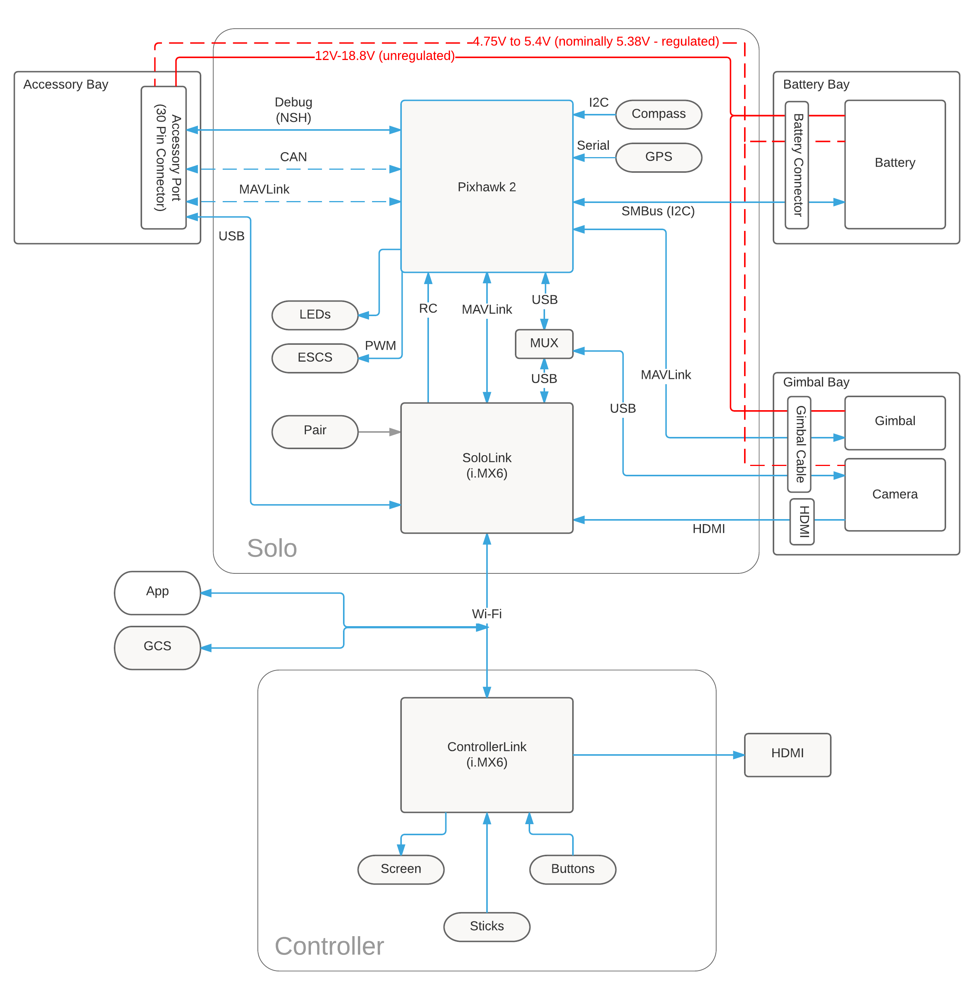

# System Overview

Solo is a Linux system (iMX.6 running Yocto Linux) connected to a Pixhawk autopilot.

The Pixhawk controls flight modes, stabilization, and recovery in the case of an RTL event (return-to-launch). Pixhawk comminicates over the MAVLink telemetry protocol to both the onboard Linux computer and downstream devices like the Controller and mobile phone Solo apps.

The Linux system controls high-level operation of the copter: smart shots, camera and gimbal control, mobile app communication, and accessory interaction are all implemented on this layer.

